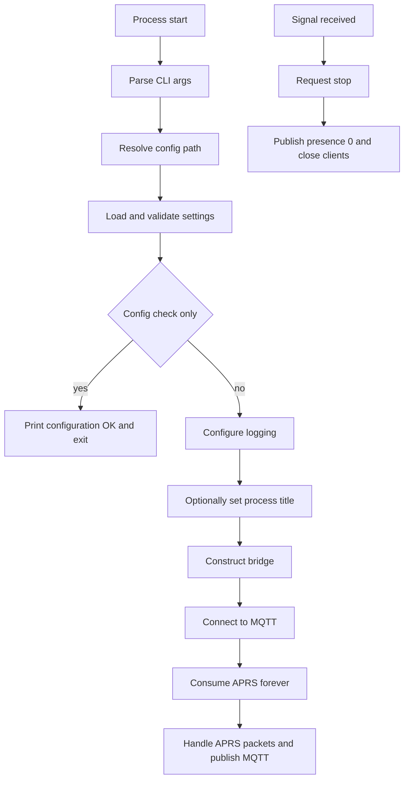

# mqtt-aprs Program Reference

This document describes how mqtt-aprs is structured internally, how it behaves at runtime, and how its MQTT and APRS interfaces are mapped.

## Purpose

mqtt-aprs is a long-running bridge between two transports:

- APRS-IS inbound traffic is consumed from a single APRS-IS connection.
- MQTT publishes are emitted under a structured topic tree rooted at `RF/<MQTT_SUBTOPIC>`.
- An optional MQTT command topic can submit one APRS frame at a time back to APRS-IS.

The program is intentionally biased toward unattended service operation:

- configuration is validated before runtime work starts
- MQTT and APRS connectivity are retried inside the process
- a retained presence topic reports whether the bridge is online
- shutdown is signal-aware and attempts to clean up both network sides

## Repository Files

| File | Purpose |
| --- | --- |
| `mqtt-aprs.py` | Main program, CLI, config loading, retry loops, MQTT publishing, and APRS handling. |
| `mqtt-aprs.cfg.example` | Annotated example configuration for `/etc/mqtt-aprs/mqtt-aprs.cfg`. |
| `mqtt-aprs.service` | Bundled systemd unit for service deployment. |
| `mqtt-aprs.default` | Legacy defaults file kept for compatibility history. The bundled unit does not currently load it. |
| `README.md` | Operator guide for installation and routine operations. |

## Startup Sequence



## Configuration Resolution

The program resolves its config file in this priority order:

1. `--config /path/to/file`
2. `MQTT_APRS_CONFIG` environment variable
3. `/etc/mqtt-aprs/mqtt-aprs.cfg`
4. `./mqtt-aprs.cfg` next to the Python script

If none of those files exists, startup fails before logging is configured and the process exits with status `1`.

## Configuration Model And Validation

All configuration lives in the `[global]` section and is normalized into the `Settings` dataclass.

### Boolean parsing

The code accepts these boolean spellings, case-insensitively:

- true values: `1`, `true`, `yes`, `on`
- false values: `0`, `false`, `no`, `off`
- blank value: uses the option's default

### Numeric parsing

- `MQTT_PORT` and `APRS_PORT` must parse as integers.
- `APRS_LATITUDE` and `APRS_LONGITUDE` must parse as floats when provided.

### Validation rules

Startup fails with `ConfigError` when any of these rules is violated:

- `[global]` section is missing
- required values are missing: `MQTT_SUBTOPIC`, `MQTT_HOST`, `APRS_CALLSIGN`, `APRS_HOST`
- `MQTT_SUBTOPIC` becomes empty after trimming leading and trailing `/`
- `MQTT_PORT` or `APRS_PORT` does not parse as an integer
- only one of `APRS_LATITUDE` or `APRS_LONGITUDE` is set
- `MQTT_TX_TOPIC` contains MQTT wildcards `+` or `#`
- `MQTT_TX_TOPIC` overlaps either the base topic or the presence topic
- `MQTT_TX_ENABLE = True` while `APRS_PASSWORD = -1`

### Derived values

Several runtime values are computed from configuration:

- MQTT base topic: `RF/<MQTT_SUBTOPIC>`
- presence topic: `RF/<MQTT_SUBTOPIC>/state`
- default transmit topic: `RF/<MQTT_SUBTOPIC>/tx`
- transmit status topic: `<MQTT_TX_TOPIC>/status`
- APRS port retry order: configured `APRS_PORT` first, then the remaining common ports from `(14580, 10152, 14581)`

## Command-Line Interface

The program exposes a deliberately small CLI:

```text
mqtt-aprs.py [-c PATH] [--check-config]
```

### Options

| Option | Meaning |
| --- | --- |
| `-c`, `--config` | Explicit path to the INI file. |
| `--check-config` | Validate config, print `Configuration OK: ...`, and exit without starting network activity. |

### Exit behavior

| Exit code | Meaning |
| --- | --- |
| `0` | Configuration check succeeded, or the long-running service exited cleanly. |
| `1` | Invalid or missing config, missing runtime dependency, fatal runtime error, or non-retryable MQTT refusal. |

## Logging And Process Identity

Logging is configured only after config validation succeeds.

- stderr is always configured as a log destination
- `LOGFILE`, when set, adds a second file handler instead of replacing stderr
- `DEBUG = True` switches the root logger to `DEBUG`
- when `DEBUG = True`, the Paho MQTT client logger is also attached to Python logging

The log format is:

```text
%(asctime)-15s %(levelname)s %(message)s
```

If the optional `setproctitle` package is installed, the process title is set to `MQTT_SUBTOPIC`. That is why a running process may appear as `aprs` rather than `python` in process listings.

## MQTT Runtime Behavior

### Client construction

The bridge creates one Paho MQTT client with these characteristics:

- protocol: MQTT v3.1.1
- clean session: `True`
- transport: `tcp`
- client ID: `<MQTT_SUBTOPIC>_<PID>`
- optional username and password from config
- retained last will on the presence topic with payload `0`

### Connection algorithm

`connect_mqtt()` performs the initial MQTT connection and handles early retry logic:

1. call `connect()` on first startup, then `reconnect()` on later attempts
2. start Paho's background network loop after the first successful socket-level `connect()`
3. wait up to `MQTT_CONNECT_TIMEOUT_SECONDS` for a CONNACK callback
4. retry after `MQTT_RETRY_SECONDS` on transient failures

The loop treats these conditions as retryable:

- socket-level `OSError`
- Paho connect error codes returned directly from `connect()` or `reconnect()`
- missing CONNACK within the timeout window
- broker-side reason codes other than the non-retryable set below

The loop treats these broker-side reason codes as fatal and exits the process:

- `1`: incorrect protocol version
- `2`: invalid client identifier
- `4`: bad username or password
- `5`: not authorized

### Presence topic semantics

The bridge publishes a retained MQTT presence state:

- `1` after a successful MQTT connection callback
- `0` during a graceful shutdown
- `0` via the broker's last-will message if the process disappears unexpectedly

Consumers can treat the presence topic as an at-a-glance service liveness check.

### Publish semantics

All MQTT publishes flow through `publish()`.

- The method logs a debug line before each publish.
- It does not block waiting for delivery acknowledgements.
- If Paho returns a non-success result code immediately, the bridge logs a warning.

Value serialization follows these rules:

| Python value | MQTT payload |
| --- | --- |
| `bytes` | UTF-8 decoded text with replacement for invalid bytes |
| `dict` | JSON string with sorted keys |
| `list` / `tuple` | comma-separated string |
| `bool` | JSON boolean text: `true` or `false` |
| anything else | trimmed `str(value)` |

This is important for APRS fields such as `path` and `telemetry`:

- `path` is published as a comma-separated string when aprslib returns a list
- `telemetry` is published as JSON text when aprslib returns a dictionary

## APRS Runtime Behavior

### APRS client construction

For each connection attempt, the bridge constructs one `aprslib.IS` client using:

- `APRS_CALLSIGN`
- `APRS_PASSWORD`
- `APRS_HOST`
- one candidate port from the retry list
- `skip_login=False`

If `APRS_FILTER` is set, it is applied to the APRS-IS client before connection.

### Connection and retry strategy

`consume_aprs_forever()` uses a nested retry loop:

- try the preferred APRS port first
- if it fails or drops, try the remaining common APRS ports
- wait 5 seconds between individual port attempts
- after all ports fail, wait `APRS_RETRY_SECONDS` before starting the cycle again

The APRS side is therefore resilient to:

- one APRS port being unavailable
- APRS-IS disconnects after a successful login
- temporary upstream outages

### Raw packet handling

Incoming APRS frames arrive as bytes or strings. When raw data must be published directly, it is decoded with `latin-1` and replacement enabled, then trimmed.

That fallback path is used when:

- `APRS_PROCESS = False`
- `aprslib.parse()` raises `ParseError`
- `aprslib.parse()` raises `UnknownFormat`
- a parsed packet is missing a source callsign but still contains its raw representation

## MQTT Topic Reference

### Base topics

| Topic | Payload | Notes |
| --- | --- | --- |
| `RF/<MQTT_SUBTOPIC>` | raw APRS frame text | Used when parsing is disabled or parsing fails. |
| `RF/<MQTT_SUBTOPIC>/state` | `1` or `0` | Retained presence state. |
| `RF/<MQTT_SUBTOPIC>/tx` | outbound APRS frame or JSON wrapper | Default command topic when transmit is enabled and no custom topic is configured. |
| `<MQTT_TX_TOPIC>/status` | JSON object | Reports success or rejection of outbound APRS attempts. |

### Per-station parsed topics

When `APRS_PROCESS = True`, parsed packets with a valid source callsign are published under:

`RF/<MQTT_SUBTOPIC>/<CALLSIGN>/<FIELD>`

| Field | Source packet key | Published type | Notes |
| --- | --- | --- | --- |
| `raw` | `raw` | text | Original APRS frame. |
| `path` | `path` | comma-separated text | Joins list values with commas. |
| `format` | `format` | text | aprslib packet format name. |
| `icon` | `symbol_table` + `symbol` | text | Two-character APRS map symbol token. |
| `latitude` | `latitude` | decimal text | Rounded to 4 decimal places. |
| `longitude` | `longitude` | decimal text | Rounded to 4 decimal places. |
| `distance` | derived | decimal text | Rounded to 2 decimals; requires both reference coordinates. |
| `altitude` | `altitude` | decimal text | Rounded to whole units; meters when `METRICUNITS = True`, feet otherwise. |
| `speed` | `speed` | decimal text | Rounded to 2 decimals; km/h when `METRICUNITS = True`, mph otherwise. |
| `course` | `course` | integer text | Published as an integer heading. |
| `comment` | `comment` | text | APRS comment field. |
| `telemetry` | `telemetry` | JSON text or string | Depends on aprslib return type. |
| `message` | `message_text` | text | APRS message body. |
| `status` | `status` | text | APRS status text. |

### Distance calculation

Distance uses the haversine formula between the configured reference point and the station coordinates.

- reference coordinates come from `APRS_LATITUDE` and `APRS_LONGITUDE`
- output is kilometers when `METRICUNITS = True`
- output is miles when `METRICUNITS = False`
- output is rounded to 2 decimal places

If either reference coordinate is missing, no `distance` topic is published.

## MQTT-To-APRS Transmission Path

Transmission is disabled by default and exists behind both config and runtime checks.

### Enablement conditions

Outbound APRS transmission is available only when all of these are true:

- `MQTT_TX_ENABLE = True`
- `APRS_PASSWORD` is a verified APRS passcode, not `-1`
- the bridge is currently connected to APRS-IS

### Accepted payload formats

The subscribed MQTT TX topic accepts either:

1. raw APRS frame text
2. a JSON string containing the frame text
3. a JSON object with a non-empty `packet` field

Examples:

```text
N0CALL>APRS,TCPIP*:>status text
```

```json
"N0CALL>APRS,TCPIP*:>status text"
```

```json
{"packet": "N0CALL>APRS,TCPIP*:>status text"}
```

### Validation rules for outbound APRS

`validate_outbound_packet()` rejects payloads when:

- the payload is empty
- JSON is malformed
- a JSON object does not contain a non-empty `packet` field
- the packet contains `\r` or `\n`
- the packet begins with `#` and therefore looks like an APRS-IS server command
- the packet does not contain both `>` and `:`
- the source callsign base does not match the configured APRS callsign base

### Transmit status topic

Every accepted or rejected transmit attempt produces a status message on `<MQTT_TX_TOPIC>/status`.

Payload shape:

```json
{
  "ok": true,
  "packet": "N0CALL>APRS,TCPIP*:>status text"
}
```

On error, an additional `error` field is included:

```json
{
  "ok": false,
  "packet": "...original payload or packet...",
  "error": "APRS-IS is not currently connected"
}
```

## Shutdown Behavior

`request_stop()` is called when:

- systemd sends SIGTERM
- the process receives SIGINT
- `main()` exits through its `finally` block

Shutdown sequence:

1. set the shared stop event
2. close the APRS client if one exists
3. publish retained presence `0` once for graceful shutdown
4. disconnect the MQTT client
5. stop Paho's network loop thread if it was started

This means graceful termination updates the presence topic immediately, while an ungraceful crash relies on MQTT last-will delivery.

## Systemd Deployment Notes

The bundled `mqtt-aprs.service` uses:

- `ExecStartPre` with `--check-config`
- `ExecStart` for the long-running process
- `Restart=on-failure`
- `RestartSec=5`
- `After=network.target`

The unit intentionally does not depend on `network-online.target`.

Reason:

- the bridge already retries MQTT and APRS connectivity internally
- waiting for `network-online.target` is often brittle on systems with mixed networking stacks
- service startup is therefore faster and more portable across Debian installations

## Operational Reference

### Validate config only

```bash
/opt/mqtt-aprs/venv/bin/python /opt/mqtt-aprs/mqtt-aprs.py --check-config
```

### Run in the foreground

```bash
/opt/mqtt-aprs/venv/bin/python /opt/mqtt-aprs/mqtt-aprs.py --config /etc/mqtt-aprs/mqtt-aprs.cfg
```

### Show service logs

```bash
sudo journalctl -u mqtt-aprs -n 100 --no-pager
sudo journalctl -b -u mqtt-aprs -o short-monotonic --no-pager
```

### Watch MQTT output

```bash
mosquitto_sub -h 10.0.0.1 -v -t 'RF/aprs/#'
```

### Publish a test outbound APRS frame

```bash
mosquitto_pub -h 10.0.0.1 -t RF/aprs/tx -m 'N0CALL>APRS,TCPIP*:>status text'
```

## Code Map

| Symbol | Role |
| --- | --- |
| `Settings` | Immutable normalized configuration used throughout runtime. |
| `load_settings()` | Parses the INI file and enforces semantic validation rules. |
| `configure_logging()` | Attaches stderr and optional file logging handlers. |
| `MqttAprsBridge` | Main runtime coordinator for MQTT, APRS, and optional transmit. |
| `connect_mqtt()` | Handles initial MQTT connection, CONNACK wait, and retry behavior. |
| `consume_aprs_forever()` | Maintains APRS-IS connectivity with port failover. |
| `handle_aprs_packet()` | Chooses raw fallback or parsed publish path per packet. |
| `publish_parsed_packet()` | Maps parsed APRS fields onto MQTT topics. |
| `extract_tx_packet()` | Decodes accepted MQTT TX payload shapes. |
| `validate_outbound_packet()` | Applies APRS transmit guardrails. |
| `main()` | CLI entrypoint and top-level error handling. |

## Legacy And Compatibility Notes

- `mqtt-aprs.default` is not read by the current Python code.
- `mqtt-aprs.default` is also not referenced by the bundled systemd unit.
- It remains in the repository as a packaging-era artifact and may still be useful to users maintaining older local service wrappers.

## Non-Goals And Current Limits

The current implementation intentionally does not provide:

- TLS configuration for MQTT
- structured JSON payloads for every APRS field
- automated tests in the repository
- an HTTP health endpoint or Prometheus metrics
- persistence of APRS history outside MQTT consumers

These are reasonable future extensions, but they are not part of the present runtime contract.